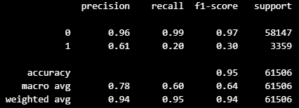

# project-4
# Heart Attack Risk: 
### Neural Network modeling of Heart Attack Risk

## Introduction

We are team 1 and would like to welcome you all to our presentation on heart attack risk prediction. 
Heart disease is the leading cause of death worldwide, responsible for approximately 17.9 million deaths annually.
Today, we'll explore how cutting-edge technologies, such as neural network modeling, are revolutionizing our approach to understanding and mitigating heart attack risk.

## Summary and Key Findings

We focused on leveraging advanced neural network modeling techniques. Utilizing data from CDC's BRFSS surveys, we identified crucial health indicators and uncovered strong correlations with variables like state of residence through exploratory analysis. Our model development, led by Sally and Kenia, utilized auto-optimization techniques to fine-tune hyperparameters. However, perfect accuracy in model performance metrics raised skepticism about dataset integrity, prompting further investigation into survey methodologies and potential biases.

Key Factors 
* Dataset - We utilized CDC's BRFSS surveys to collect key health indicators related to heart disease risk factors, refining the dataset to a smaller amount and more relevant variables.
* Exploratory Analysis & Data Prep - Despite our attempts to streamline the dataset by reducing its complexity through dimensionality reduction, we discovered strong correlations between heart attack risk and diverse variables
* Initial Model Attempt – We initiated exploration into neural network modeling using auto-optimization technique.
* Final Model Overview - Our selected model architecture, emphasized key decisions including the choice of activation function, layers, nodes, and epochs.
* Model Performance - The model's performance metrics, revealed remarkable accuracy but raised skepticism due to the absence of false positives or negatives.

## Data Source

The dataset covers personal health indicators related to heart disease risk factors, sourced from the Centers for Disease Control and Prevention (CDC) as part of the Behavioral Risk Factor Surveillance System (BRFSS) surveys conducted annually across the United States.
The dataset encompasses essential variables such as hypertension, lipid profile, smoking habits, diabetes status, body mass index (BMI), physical activity level, and alcohol consumption. These factors serve as vital indicators, providing valuable insights into an individual's susceptibility to the risk of experiencing a heart attack. Originally comprising nearly 300 variables, the dataset was refined to 40 relevant variables for analysis. Our target variable is the binary variable that indicates whether heart disease is present. We aim to predict this using the other variables in the dataset.

## Exploratory Analysis & Data Prep

**Tableau Dashboard:** https://public.tableau.com/app/profile/nathan.hans1874/viz/HeartAttack_17108064501530/Indicators?publish=yes

* Strong correlation between heart attack risk and numerous other variables

* Interestingly, state of residence is also a strong indicator of risk

* PySpark (Jonah): We used PySpark to spotcheck a couple variables and see if any obvious correlations were present in some numerical variables like BMI and hours of sleep.

* PCA: (Jonah) Initially, we decided to look at some clustering methods for this data to determine if the complexity can be reduced and whether the variation in the data can be explained by a smaller subset of constructed variables. This was not the case. PCA decomposition showed that no single constructed variable can explain a significant portion of variance in the data. In fact, we attempted PCA with 20 components and only achieved an explained variance ratio of 32%. This suggests a couple of facts about the dataset and any further modeling.
 
 

 1) There aren’t many variables that are correlated with one another, so each one is important to understanding the variation in the data, and 
 
 2) any model that successfully predicts presence of heart disease will need to be relatively complex in terms of the number of variables or functions of variables it considers at the input stage.

**PySpark Queries**

## Initial Model Attempt - Auto optimization

To start off the investigation into the dataset and try to learn the best way to incorporate a neural network, kenia and I worked simultaneously on our own models. I decided to use the auto-optimization technique.

**Defining a Custom Model Creation Method (create_model)
hyperparameter object 'hp' as input:**

* This initializes a Sequential model (nn_model) using TensorFlow's Keras API.
* Kerastuner, which is a hyperparameter optimization library, decides the activation function to use in the hidden layers. The options: 'relu', 'tanh', or 'sigmoid'.
* Kerastuner decides the number of neurons in the first layer, within a range specified by the hyperparameter ”first_units”.
* It then iterate over a range of possible numbers of hidden layers ‘ num_layers’, adding dense layers with neurons determined by hyperparameters ‘units_i’ where i ranges from 0 to the chosen number of layers.
* It adds an output layer with one neuron using a sigmoid activation function.
* The model is compiled with binary cross-entropy loss, Adam optimizer, and accuracy as the metric.

**Importing Kerastuner Library and Setting up Hyperband Tuner:**

* The Hyperband tuner (tuner) which takes in the create_model method defined earlier.
T* he objective of the tuner is to maximize validation accuracy (val_accuracy).
* max_epochs specifies the maximum number of epochs to train each model configuration.
* hyperband_iterations specifies the number of times to apply the Hyperband algorithm. It's essentially a hyperparameter optimization algorithm that uses adaptive resource allocation and early stopping to quickly converge to a high-performing model.

**Hyperparameter Search:**

* tuner.search initiates the hyperparameter search process.
* It takes the training data (X_train_scaled, y_train_encoded) and validation data (X_test_scaled, y_test_encoded).
* The search is performed over 20 epochs for each configuration 
* The tuner will search for the best hyperparameters configuration within the specified search space.

Overall, this code sets up a neural network model creation method with tunable hyperparameters, initializes a Hyperband tuner to optimize these hyperparameters, and then conducts a search over the hyperparameter space to find the best configuration for the given dataset.

### **5 Top Model Architectures with Input Layer of 102 and Output Layer of 1 node and Activation Function of Sigmoid:**

***Model 1:***

    Hidden layer 1: 7 units, Activation function: ReLU
    Hidden layer 2: 1 unit, Activation function: ReLU
    Hidden layer 3: 9 units, Activation function: ReLU
    Number of epochs: 7

*Confusion Matrix*

*Classification Report:*

*Accuracy Score:*

***Model 2:***

    Hidden layer 1: 9 units, Activation function: ReLU
    Number of epochs: 20

*Confusion Matrix*

*Classification Report:*

*Accuracy Score:*

***Model 3:***

    Hidden layer 1: 9 units, Activation function: ReLU
    Number of epochs: 7

*Confusion Matrix*

*Classification Report:*

*Accuracy Score:*

***Model 4:***

    Hidden layer 1: 5 units, Activation function: ReLU
    Number of epochs: 20

*Confusion Matrix*

*Classification Report:*

*Accuracy Score:*

***Model 5:***

    Hidden layer 1: 5 units, Activation function: ReLU
    Number of epochs: 7

*Confusion Matrix*

*Classification Report:*

*Accuracy Score:*

## Official Model Overview- Neural Network

We chose to use a Neural Network model due to the nature of NN’s being able to learn and model relationships between input and output data that are more complex and nonlinear. Which we felt suited our data for our predictive analysis. 
When building the model, there were several parameters to fill such as how many layers, how many nodes, and best fit activation function. In our model we used a total of 3 layers: 1 input layer, 1 hidden layer, and 1 output layer. 
We used a Sigmoid activation across all 3 layers, given that it exists between 0 & 1, allowing us to predict those at risk of a heart attack which presented as 0s or 1s in our input data. 
The number of units and epochs were decided through an exploratory process, as we reached high accuracy and low loss very early on when training our model.  

## Model Performance

## Next Steps & Skepticism of Result

100% accuracy, no false positives, no false negatives, accuracy was achieved after 2 Epochs!!!
Lead us to believe that there was something cooked in the dataset, so we ran the entire process again on a different dataset.  AND…..
100% accuracy, no false positives, no false negatives, accuracy was achieved after 2 Epochs!!!
 

## Conclusion

CDC is really good at asking the right questions in telephone surveys?
Both of the datasets that we used to test/train the model were ‘cooked’, or cherry picked.
